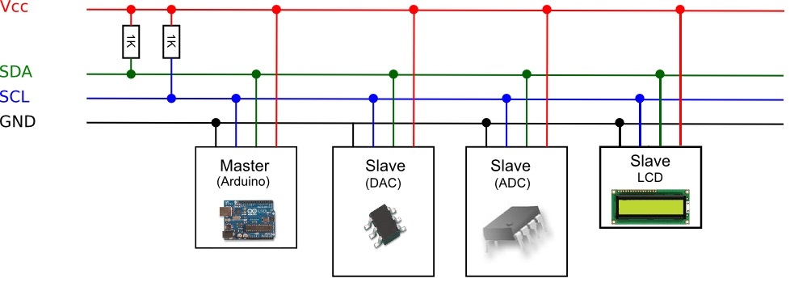
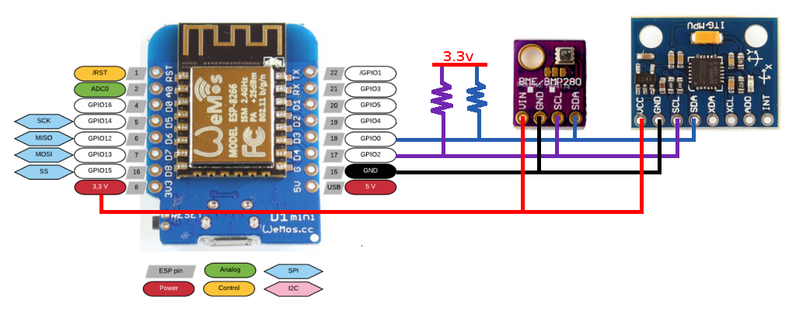
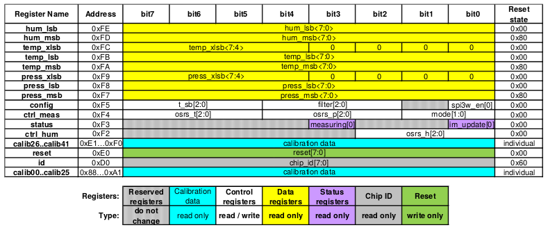

# Práctica 2 - El bus I2C

## Introducción

Antes de comenzar, se debe entender el concepto de bus:

> En arquitectura de computadores, el **bus** (o canal) es un sistema digital que transfiere datos entre los componentes de una computadora. Está formado por cables o pistas en un circuito impreso, dispositivos como resistores y condensadores, además de circuitos integrados.
> 
> Existen dos tipos de transferencia en los buses:
> 
> * Serie: El bus solamente es capaz de transferir los datos bit a bit. Es decir, el bus tiene un único cable que transmite la información.
> * Paralelo: El bus permite transferir varios bits simultáneamente, por ejemplo 8 bits.
> 
> Aunque en primera instancia parece mucho más eficiente la transferencia en paralelo, esta presenta inconvenientes:
> 
> * La frecuencia de reloj en el bus paralelo tiene que ser más reducida.
> * La longitud de los cables que forman el bus está limitada por las posibles interferencias, el ruido y los retardo en la señal.
> 
> Además, los modernos buses serie están formados por varios canales: En este caso se transmite por varios buses serie simultáneamente. 
> 
> <small>[Wikipedia](https://es.wikipedia.org/wiki/Bus_(inform%C3%A1tica))</small>

El **bus I2C** surge como una solución de comunicación entre los chips de un circuito y es una norma que especifica la velocidad, niveles de tensión, y el protocolo a seguir para conseguir dicha comunicación.

Se basa en una comunicación de tipo Maestro-Esclavo, donde varios chips se conectan entre si en paralelo, compartiendo las lineas de alimentación, Vcc y GND, y dos específicas, SCL (linea de reloj) y SDA (linea de datos).

Esto mismo se representa en la siguiente figura:



El maestro, cuando quiera iniciar una comunicación, establecerá una frecuencia en la línea de SCL, que normalmente será 100 kHz o 400 kHz, e iniciará la comunicación como corresponda a traves de la linea SDA.

Dicha comunicación se hará localizada a un chip concreto, mediante su dirección de esclavo de 7 bits. Esto hace que el bus admita hasta 128 dispositivos.

Para no alargar la introducción entrando en detalles técnicos de nivel mas bajo, se facilita el documento oficial de NXP (antes Phillips) de especificaciones y uso del bus I2C. No será necesaria su lectura para la práctica, pero no está de mas tener a mano la documentación de cada parte para casos de duda, aprendizaje o pura curiosidad.

> Descargar [<i class="fa fa-cloud-download-alt" style="color:#FA023C"></i> I2C-bus specification and user manual (UM10204)](UM10204.pdf)

## Como continuar

Lo siguiente será informarse del manejo y control del bus I2C desde el punto de vista de Arduino, quien abstraerá todo el bajo nivel a modo de funciones incluidas mediante librerías.

> El uso de librerias y trabajo de terceros es una practica habitual y recomendada. Es una de las grandes virtudes de la comunidad Open Source y Arduino.
> 
> Hay una gama muy amplia de librerias que sirven para dar soporte a dispositivos, para crear funcionalidades nuevas, ...
> 
> Se recomienda buscar, probar y sacar conclusiones para ver tanto la calidad como el posible uso.

Dichas librerias pueden ser parte del conjunto estándar, incluido de serie al instalar Arduino, o pueden ser de terceros, como sucede con la librería que da soporte Arduino al chip *ESP8266* (de otro modo, no sería posible trabajar con el entorno de Arduino y la placa proporcionada).

Para poder usarlas es necesario leer su documentacion de antemano, que se compone de:

1. **Librerias ESP8266 para Arduíno**: Se debe consultar para saber como manejar los periféricos del micro.    
[https://arduino-esp8266.readthedocs.io/en/latest/libraries.html](https://arduino-esp8266.readthedocs.io/en/latest/libraries.html)
2.  **Librerias de Arduino**: Una vez vistos los pormenores de la parte especifica para ESP8266, se debe consultar esta para conocer el manejo genérico en todos los Arduino.    
[https://www.arduino.cc/en/Reference/Libraries](https://www.arduino.cc/en/Reference/Libraries)

Como se indica, se recomienda primero ver la parte específica y luego la general, ya que tendrá preferencia en el momento de su uso. Esto pasa con la funcion `Wire.begin()`:

`Wire.begin()` existe en ambas librerias y se llaman de forma diferente, lo que puede dar lugar a fallos y confusión aunque el programa sea totalmente correcto.

Lo correcto será usar `Wire.begin(0, 2)` como dicta la libreria del ESP8266: [Wire.begin(SDA_pin, SCL_pin)](https://arduino-esp8266.readthedocs.io/en/latest/libraries.html#i2c-wire-library). Esto arrancará el periférico I2C en modo maestro usando concrétamente esos pines.

Como en la libreria del ESP8266 no aparece ninguna otra referencia al bus I2C, el resto de funciones se usarán como dicta la libreria `Wire` de Arduino.

## Práctica

En esta práctica se busca conseguir una comunicación a traves del bus I2C con el dispositivo [<i class="fa fa-link" style="color:#FA023C"></i> BME280](../../hardware/#sensor-bme280-temperatura-humedad-y-presion) acoplado al D1 Mini.

Para referencia, el montaje proporcionado equivale al siguiente esquemático:



### Primera comunicación I2C

Para poder comenzar con el uso de las funciones de I2C es necesario incluir la cabecera de la libreria `Wire`, al principio de nuestro programa, de la siguiente forma:

```C
/* Include required headers and/or libraries */
#include <Wire.h>
```

Incluir su inicialización en la sección de setup:

```C
/* Single-pass function to configure the app */
void setup()
{
  /* Join i2c bus (address optional for master) */
  Wire.begin(0, 2);

  /* Start serial for output */
  Serial.begin(115200);
}
```

Y por último, pedir un dato a algún dispositivo esclavo en el bucle principal, mostrándolo por pantalla para saber que está bien:

```C
/* Recurrent task, called forever */
void loop()
{
  /* Welcome message! Useful as a control point */
  Serial.printf("Ahoy! ESP8266 here!\n---\n");

  /* Request data from slave with address 0x12 */
  Wire.requestFrom(0x12, 1);

  /* Receive the byte */
  uint8_t c = Wire.read();

  /* Send it to console/monitor */
  Serial.printf("Received byte: 0x%02X\n", c);

  /* Ensure not to flood with a huge amount of fast data */
  delay(500);
}
```

Al lanzar el programa no se llevará a cabo una comunicación válida por no existir un esclavo con la dirección `0x12`, lo que deja la duda de .. *entonces cual es la correcta?*.

Para responderla es necesario **estudiar los dispositivos**, documentandose sobre su funcionamiento y sus modos de trabajo, de forma que posteriormente se pueda programar la tarea siguiendo el flujo de trabajo establecido por el fabricante.

### Leer un byte

En el caso del BME280, tras leer [<i class="fa fa-link" style="color:#FA023C"></i> su datasheet](../../hardware/BME280_datasheet_en.pdf), vemos como la dirección asociada será `0x76` o `0x77`, según si uno de sus pines está puesto a GND o a Vcc. En el caso de la placa de prácticas, este pin está en GND por lo que la dirección final queda como `0x76`.

Otro punto a tener en cuenta es que no se está controlando la disponibilidad de datos, y se pide su lectura como si esto fuera un hecho, pero lo cierto es que es posible que el dispositivo pueda tardar en responder.

Si se intenta leer cuando no hay dato, y cuando hay dato no se lee, se puede llegar al caso en el que los datos no estén sincronizados, o que incluso se pierdan. Para solventar esto, y leer solo si hay datos, existe la función [Wire.available()](https://www.arduino.cc/en/Reference/WireAvailable).

Incluyendo ambos cambios, nuestro nuevo programa quedaría como:

```C
/* Include required headers and/or libraries */
#include <Wire.h>

/* Single-pass function to configure the app */
void setup()
{
  /* Join i2c bus (address optional for master) */
  Wire.begin(0, 2);

  /* start serial for output */
  Serial.begin(115200);
}

/* Recurrent task, called forever */
void loop()
{
  /* Welcome message! Useful as a control point */
  Serial.printf("Ahoy! ESP8266 here!\n---\n");

  /* Request data from slave with address 0x76 */
  Wire.requestFrom(0x76, 1);

  /* Wait for data to be available */
  while (Wire.available())
  {
    /* Receive the byte */
    uint8_t c = Wire.read();

    /* Send it to console/monitor */
    Serial.printf("Received byte: 0x%02X\n", c);
  }

  /* Ensure not to flood with a huge amount of fast data */
  delay(500);
}
```

<small>*Ver sketch [<i class="fab fa-github" style="color:#FA023C"></i> BME280_available-byte.ino](https://github.com/euroavia-sevilla/curso-c-arduino/tree/master/arduino/sketch/BME280_available-byte/BME280_available-byte.ino) en GitHub*</small>

El programa debería imprimir por puerto serie algo parecido a:

```text
Ahoy! ESP8266 here!
---
Received byte: 0x03
Ahoy! ESP8266 here!
---
Received byte: 0x1E
Ahoy! ESP8266 here!
---
Received byte: 0x27
Ahoy! ESP8266 here!
---
Received byte: 0x41
```

Pasado un tiempo los bytes mostrados deben comenzar a repetirse, lo que indicará que estamos leyendo los datos del BME280 adecuadamente. Esto pasa porque su puntero interno se incrementa automáticamente con cada lectura, y se reinicia llegado a un tope.

### Leer de una dirección concreta

Si nos fijamos bien, en el ejemplo anterior no estamos controlando qué dato pedimos, simplemente "leemos un byte".

Para poder pedir un dato de una dirección concreta es necesario direccionarlo primero. De nuevo [<i class="fa fa-link" style="color:#FA023C"></i> su datasheet](../../hardware/BME280_datasheet_en.pdf) detalla cómo leer y escribir un dato, de donde se extrae la siguiente figura, que representa la forma general de leer varios bytes de direcciones consecutivas.


Interpretándola, será necesario:

1. Hacer una escritura, en la que el dato enviado será la dirección de la que queremos leer
2. El BME280 internamente reposicionará su puntero de memoria.
3. Entonces se procede a la lectura
4. Ahora es cuando el BME280 devolverá los datos almacenados a partir de la dirección pedida

Si en lugar de varios queremos un único byte, simplemente tendremos que pedir un único byte <i class="far fa-smile"></i>.

> Para confirmar la comunicación se suele leer primero un byte conocido, que para el caso del BME280 es el identificador del chip, o **Chip ID**, localizado en la dirección `0xD0`.
> 
><small>[Ver la sección dedicada al BME280](../../hardware/#sensor-bme280-temperatura-humedad-y-presion) para mas información</small>

Si todo esto se traduce a código, lo visto quedaría como:

```C
/* Include required headers and/or libraries */
#include <Wire.h>

/*
 * Single-pass function to configure the app
 */
void setup()
{
  /* Join i2c bus (address optional for master) */
  Wire.begin(0, 2);

  /* start serial for output */
  Serial.begin(115200);
}

/*
 * Recurrent task, called forever
 */
void loop()
{
  /* Welcome message! Useful as a control point */
  Serial.printf("Ahoy! ESP8266 here!\n---\n");

  /* Tell the BME280 where we want to read */
  Wire.beginTransmission(0x76);
  Wire.write(0xD0);
  Wire.endTransmission();

  /* Request data from slave with address 0x76 */
  Wire.requestFrom(0x76, 1);

  /* Wait for data to be available */
  while (Wire.available())
  {
    /* Receive the byte */
    uint8_t c = Wire.read();

    /* Send it to console/monitor */
    Serial.printf("Received byte: 0x%02X\n", c);
  }

  /* Ensure not to flood with a huge amount of fast data */
  delay(500);
}
```

<small>*Ver sketch [<i class="fab fa-github" style="color:#FA023C"></i> BME280_byte-addressing.ino](https://github.com/euroavia-sevilla/curso-c-arduino/tree/master/arduino/sketch/BME280_byte-addressing/BME280_byte-addressing.ino) en GitHub*</small>

El programa debería imprimir por puerto serie exáctamente lo siguiente:

```text
Ahoy! ESP8266 here!
---
Received byte: 0x60
Ahoy! ESP8266 here!
---
Received byte: 0x60
Ahoy! ESP8266 here!
---
Received byte: 0x60
Ahoy! ESP8266 here!
---
Received byte: 0x60
```

Que indicará que se ha leído correctamente el identificador de chip, localizado en la dirección `0xD0`, con el valor esperado de `0x60`.

### Leer un bloque de memoria

Siguiendo la misma linea del ejemplo anterior, lo lógico sería pensar en hacer varios `Wire.read()` y salvar el resultado, algo como:

```C
(...)
  /* Request data from slave with address 0x76 */
  Wire.requestFrom(0x76, 3);

  /* Wait for data to be available */
  while (Wire.available())
  {
    /* Receive the byte */
    uint8_t c0 = Wire.read();
    uint8_t c1 = Wire.read();
    uint8_t c2 = Wire.read();

    /* Send it to console/monitor */
    Serial.printf("Received bytes: 0x%02X, 0x%02X and 0x%02X\n", c0, c1, c2);
  }
(...)
```

Pero resulta un método tedioso y muy poco eficiente, en el que un bloque simple de 128 bytes sería un programa enorme para una tarea muy sencilla.

En este momento entran en juego los `arrays`, que son matrices compuestas por un numero finito de elementos de algún tipo definido. Para este caso se deberá usar un array de elementos de tipo `uint8_t`.

Junto al array, se utilizará una variable secundaria que servirá de índice para almacenar la posición dentro del array donde se salvará el siguiente dato. Esta variable comenzará siendo 0 y se incrementará cada vez que se reciba un dato.

Ahora queda saber desde qué dirección comenzar a leer, y para esto el datasheet proporciona el mapa de registros en memoria y sus direcciones, como se ve en la siguiente figura:



Como se puede observar, el primer dato se encuentra en la dirección `0x88` y el último en la `0xFE`, sumando un total de 118 bytes.

> Arduino tiene un limite interno para `Wire.requestFrom()` de **128 bytes**, y como se necesitan sólo 118 no debería haber problema, pero hay que tenerlo en cuenta en caso de necesitarse transferencias de mayor tamaño, ya que habría que fraccionarlas.

Llevado a código, el nuevo programa podría quedar como sigue:

```C
/* Include required headers and/or libraries */
#include <Wire.h>

#define SLAVE_ADDRESS 0x76
#define BLOCK_ADDRESS 0x88
#define BLOCK_LENGTH 118

/*
 * Single-pass function to configure the app
 */
void setup()
{
  /* Join i2c bus (address optional for master) */
  Wire.begin(0, 2);

  /* start serial for output */
  Serial.begin(115200);
}

/*
 * Recurrent task, called forever
 */
void loop()
{
  /* Welcome message! Useful as a control point */
  Serial.printf("Ahoy! ESP8266 here!\n---\n");

  /* Tell the BME280 where we want to read */
  Wire.beginTransmission(SLAVE_ADDRESS);
  Wire.write(BLOCK_ADDRESS);
  Wire.endTransmission();

  /* Use static to prevent block re-allocation on each pass */
  static uint8_t memory_map[BLOCK_LENGTH] = { 0x00 };

  /* Array index, stores position to write a received byte */
  uint8_t memory_idx = 0;

  /* Used to check the received amount */
  uint8_t rx_bytes = 0;

  /* Request data from slave */
  Wire.requestFrom(SLAVE_ADDRESS, BLOCK_LENGTH);

  /* Wait for data to be available */
  while (rx_bytes == 0)
  {
    rx_bytes = Wire.available();
  }

  /* Save the block */
  for (memory_idx = 0; memory_idx < rx_bytes; memory_idx++)
  {
    memory_map[memory_idx] = Wire.read();
  }

  /* Print the block */
  Serial.printf(" ++ | 00 01 02 03 04 05 06 07 08 09 0A 0B 0C 0D 0E 0F\n");
  Serial.printf("----+------------------------------------------------");
  for (memory_idx = 0; memory_idx < rx_bytes; memory_idx++)
  {
    /* Create a new line each 16 printed bytes */
    if ((memory_idx % 16) == 0)
    {
      Serial.printf("\n %02X |", memory_idx + BLOCK_ADDRESS);
    }

    /* Print a byte */
    Serial.printf(" %02X", memory_map[memory_idx]);
  }
  Serial.printf("\nEnd of data\n");

  /* Ensure not to flood with a huge amount of fast data */
  delay(500);
}
```

<small>*Ver sketch [<i class="fab fa-github" style="color:#FA023C"></i> BME280_block-read.ino](https://github.com/euroavia-sevilla/curso-c-arduino/tree/master/arduino/sketch/BME280_block-read/BME280_block-read.ino) en GitHub*</small>

En este ejemplo se ha incluido el uso de macros de precompilacion, como por ejemplo pasa con `#define BLOCK_LENGTH 118`.

Esto crea `BLOCK_LENGTH`, que parece y funciona como una variable ya que se sustituye por el numero 118, pero que se sustituye **antes** de compilar el programa, por lo que es como si se escribiera el numero 118 en el propio código.

* **Macro frente a Variable:** La diferencia es que al tratarse de un valor constante, pues 118 no cambiará nunca a lo largo del programa, usar una variable para esto es un malgasto de memoria RAM.
* **Macro frente a Número:** La diferencia es que el uso de un nombre descriptivo frente a un simple numero siempre será mas claro de leer y de entender. El uso de números sin descripción es una mala práctica, y debe evitarse siempre que sea posible. Se conoce tambien como 'hardcoding' o 'magic numbers':    
> In computer programming, the term *magic number* has multiple meanings. It could refer to one or more of the following:
>
> * **Unique values with unexplained meaning or multiple occurrences which could (preferably) be replaced with named constants**
> * A constant numerical or text value used to identify a file format or protocol; for files, see List of file signatures
> * Distinctive unique values that are unlikely to be mistaken for other meanings (e.g., Globally Unique Identifiers)
>
> <small>[Wikipedia](https://en.wikipedia.org/wiki/Magic_number_(programming))</small>

El programa debería imprimir por puerto serie algo parecido a:

```text
Ahoy! ESP8266 here!
---
 ++ | 00 01 02 03 04 05 06 07 08 09 0A 0B 0C 0D 0E 0F
----+------------------------------------------------
 88 | B7 6E DD 67 32 00 79 92 3E D6 D0 0B 5F 28 D7 FE
 98 | F9 FF 0C 30 20 D1 88 13 00 4B A5 00 00 00 00 00
 A8 | 00 00 00 00 33 00 00 C0 00 54 00 00 00 00 60 02
 B8 | 00 01 FF FF 1F 60 03 00 00 00 00 FF 00 00 00 00
 C8 | 00 00 00 00 00 00 00 00 60 00 00 00 00 00 00 00
 D8 | 00 00 00 00 00 00 00 00 00 56 01 00 17 20 03 1E
 E8 | 27 41 FF FF FF FF FF FF FF 00 00 00 00 00 00 80
 F8 | 00 00 80 00 00 80
End of data
Ahoy! ESP8266 here!
---
 ++ | 00 01 02 03 04 05 06 07 08 09 0A 0B 0C 0D 0E 0F
----+------------------------------------------------
 88 | B7 6E DD 67 32 00 79 92 3E D6 D0 0B 5F 28 D7 FE
 98 | F9 FF 0C 30 20 D1 88 13 00 4B A5 00 00 00 00 00
 A8 | 00 00 00 00 33 00 00 C0 00 54 00 00 00 00 60 02
 B8 | 00 01 FF FF 1F 60 03 00 00 00 00 FF 00 00 00 00
 C8 | 00 00 00 00 00 00 00 00 60 00 00 00 00 00 00 00
 D8 | 00 00 00 00 00 00 00 00 00 56 01 00 17 20 03 1E
 E8 | 27 41 FF FF FF FF FF FF FF 00 00 00 00 00 00 80
 F8 | 00 00 80 00 00 80
End of data
```

Como puede comprobarse, el *Chip ID* puede leerse como `60` en la posición con fila `C8` y columna `08` (que se corresponde a *0xC8 + 0x08 = 0xD0*, la dirección del Chip ID).
